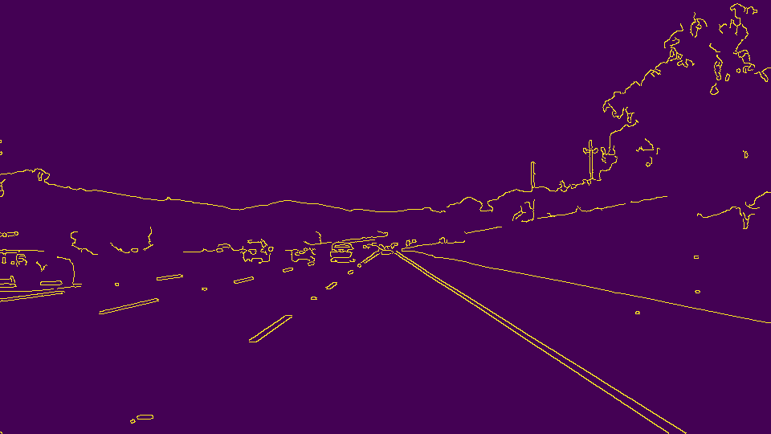
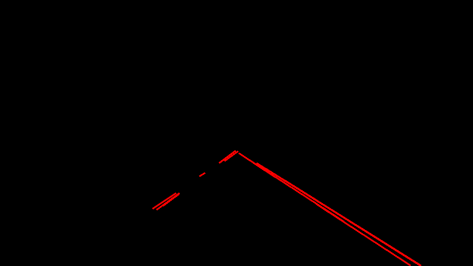
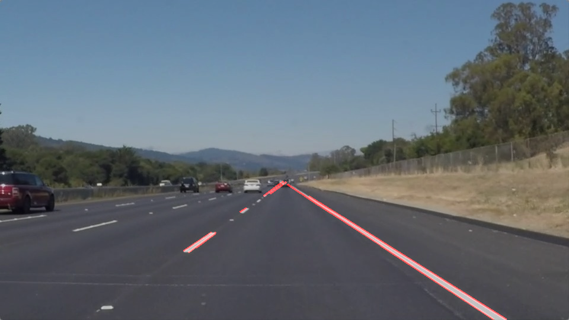
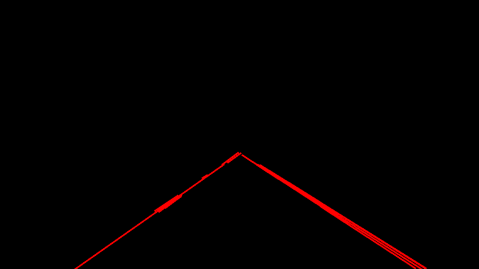
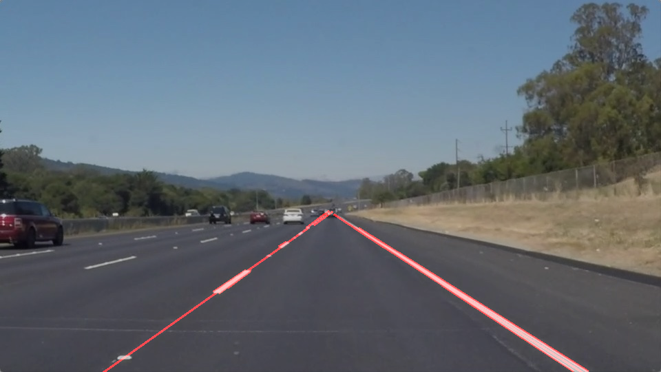

### Simple-lane-lines-finding-on-the-road
Simple SW Pipeline to identify the lane boundaries in a video from a front-facing camera on a car (Canny functions and Hough Transform)

#### Dynamic Results of lanes line detection on the road on the trial track 1 [here](https://github.com/Jeanyvesbourdoncle/Simple-lane-lines-finding-on-the-road/blob/master/test_videos_output/solidWhiteRight.mp4). 

#### Dynamic Results of lanes line detection on the road on the trial track 2 [here](https://github.com/Jeanyvesbourdoncle/Simple-lane-lines-finding-on-the-road/blob/master/test_videos_output/solidYellowLeft.mp4).
--------------------------------------------------------------------------------------------------------
The goal of this project is to make make a very simple pipeline that finds lane lines on the road.

The input data are present in the file "test_images" (static data input) and "test_videos" (dynamic data input).

The  results are present the file "test_images_output" (static results) and  "test_videos_output" (dynamic result).

---------------------------------------------------------------------------------------------------------

#### Pipeline Description

The pipeline consisted of 6 steps : 

- Step 1 : Images conversion to grayscale

 

- Step 2 : Kernel size definition and gaussian smoothing

- Step 3 : Canny functions paramters definition to obtain the edges in the image space

- Step 4 : Polygon definition to mask and  the visualization only the content of the polygon

- Step 5 : Hough transform parameters definition on the edge detected line segment

- Step 6 : Lane Line drawing on the image and in the video

---------------------------------------------------------------------------------------------------------
#### Step Draw continuous lines

In order to draw a single line on the left and right lanes, the modification of the draw_lines() function is useful.

Use of the fonction y= mx+b with 4 empties list : 
  - 2 lists for the left line (initialization) : m>0  and bleft for the left line, 
  - 2 lists for the right line (initialization) : m<0 and bright for the right line.
  
For every segment (loop "for") :
    - calculation of the slop m and the intersection b with the y axis (from the equation y = bx+m)
    - if m>0 : element m and bleft addition in the lists mpositive and leftline
    - if m<=0 : element m and bright addition in the lists mnegative and rightline
    
The lists are now completed and after the average of the 4 lists with the calculation x =(y - average(b))/(average(m)) and the y coordinate (bottom and top of the selected area). 
The deduction are :
    - for the left line :  the coordinate (xstart, ytart) and (xend,yend)
    - for the righ line :  the coordinate (xstart, ytart) and (xend,yend)

The last step is to implement this 2 lines (right and left) on the picture with he fonction cv2.line

----------------------------------------------------------------------------------------------------

#### Draw_Lines function after every pipeline step with the draw continuous line

--------------------------------------------------------------------------------
#### Conclusion and Improvement

On the top of the interested area, short perturbation are present in the video. 

The Canny threshold and the Hough parameters must be improved to delete totally these perturbations. 

